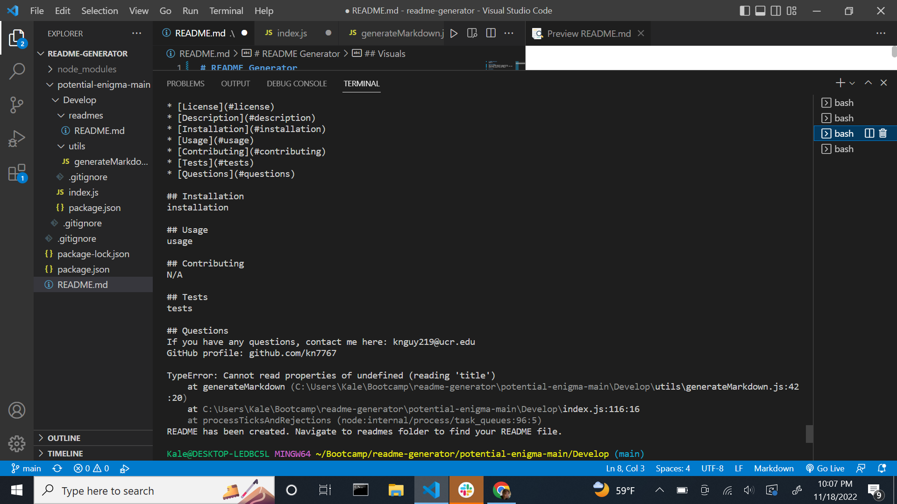

# README Generator 
module 9

## Description
This is a README generator using back-end technologies. It creates a README file for the user based on the answers the user inputs.

## Visuals

## Installation
GitBash
VS Code
Node.JS

To begin using the generator, on this GitHub repsitory, click "Code" and copy the link provided. 
On GitBash, type "git clone (link)" 
Then install version 16 of Node.JS. Window users use "node-v16.18.0-x64.msi" and Mac users use "node-v16.18.0.pkg" in your terminal to download the appropriate version of node for this generator to work.
Then type in "npm install inquirer" into your terminal. 

## Usage
In your GitBash terminal, direct yourself into the cloned file. Prompt the terminal with "node index" to begin answering questions leading to the generation of your README file. It will create a file in the folder called "readmes" within the "Develop" file, which you can then view. 

## License
None

